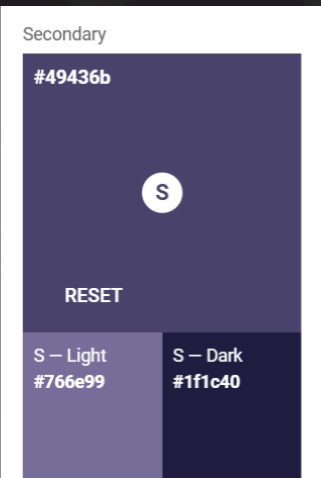
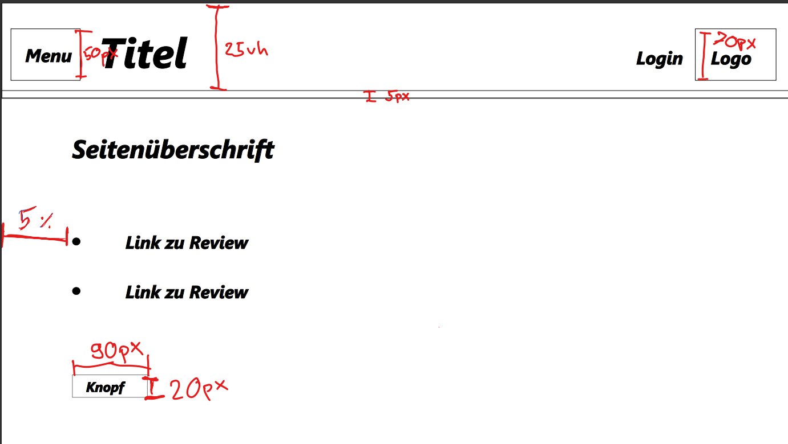
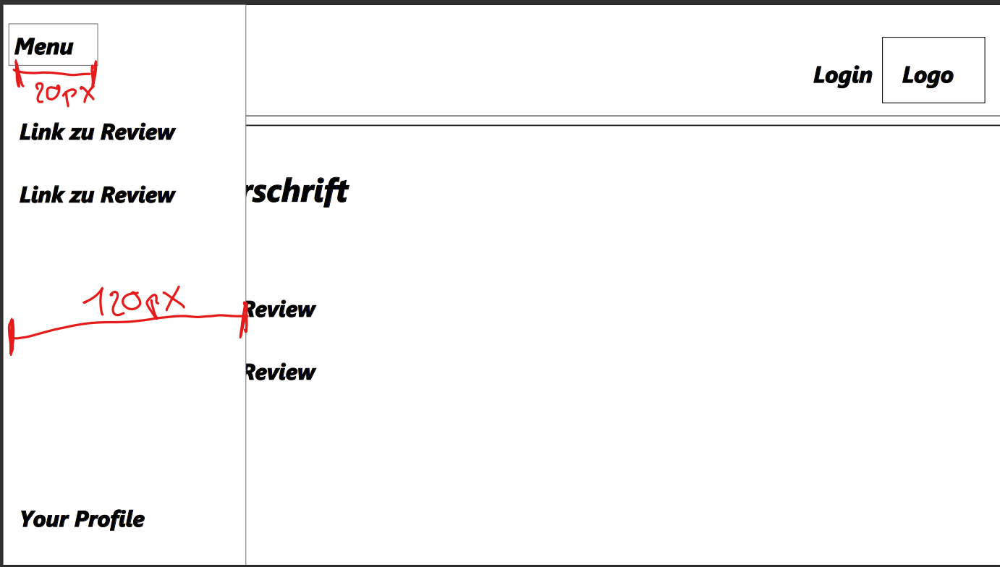
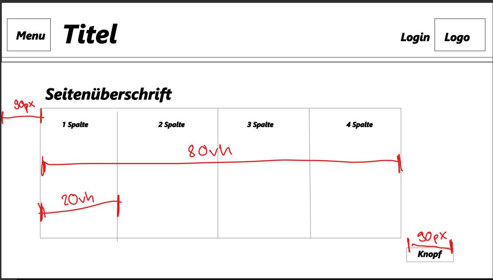

# Styleguide

## Logo


## Farben 




## Schriftarten

Arial

## Typographie

### Header

width:  100%  
height: 25vh  
border-bottom-width: 5px  

h1 

```css
h1 {
    color: white;
    font-style: initial;
    font-weight: bold;
    font-size: 30px;
}
```

### Main

width: 80%  
margin-left: 5%

h3 

```css
h3{
    font-size: 25px;
}
```

a

```css
a{
    font-size: 15px;
}
```

ul/li

```css
ul li{
    font-size: 20px;
}
```

### Menu

width:  120px    
height: 100%  


ul/li

```css
ul li{
    font-size: 25px;
}
```

### Logo

width: 70px  
height: 70px


# Wireframe



